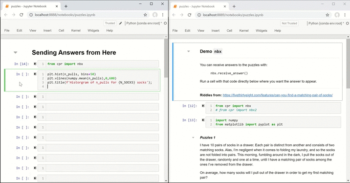

# `nbx` - Notebook Exchange
Collaborate by passing cells between notebooks on different machines.

Use your git server / GitHub to communicate b/w machines.

Try a demo repository [here](https://github.com/sutt/nbx-demo-1).
------------------------------
### Quickstart

Drop the cpr directory into a git repository.